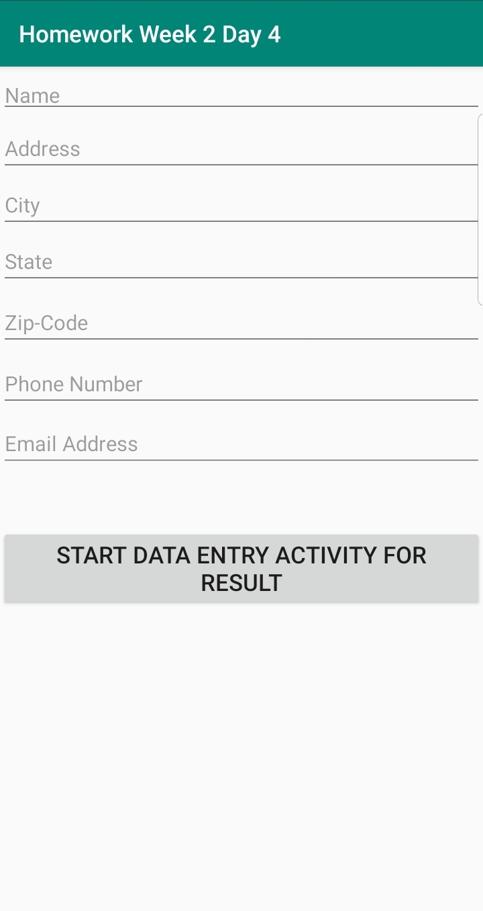
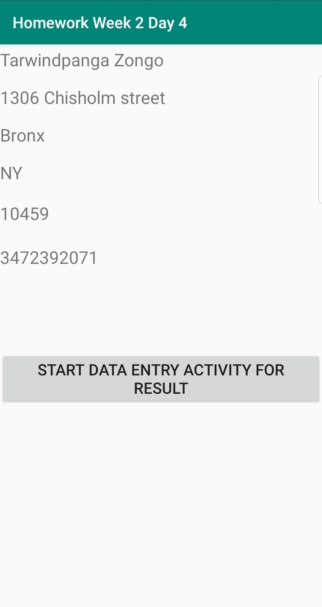

*****************  Homework Week 2 Day 4 *****************
Create an Activity where you enter a Users:
     Name
     Address
     City
     State
     Zip
     Phone Number
    Email Address

Upon a button click, save the information to the database and save the name to shared Preferences
Log the list of current users in the DB in the logcat after you insert into the database
Have a textview display the user name currently saved in shared pref

Screenshot1

Screenshot2

Screenshot3

Screenshot4

        HomeworkWeek2Day4/ScreenShot/Screenshot1.jpg
      
